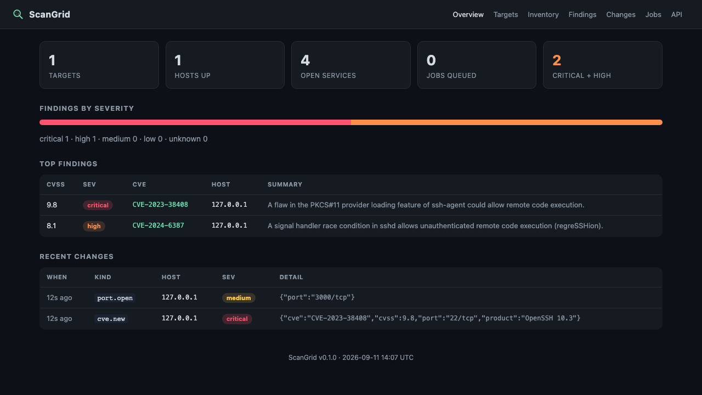

<p align="center"></p>
<h1 align="center">ScanGrid</h1>

A small distributed vulnerability scanner and asset inventory, built to run
on the same pair of Raspberry Pis as [NetSentinel](https://github.com/gorkemguler/net-sentinel).
The orchestrator keeps the job queue, the database, CVE matching and the
dashboard; a worker claims jobs and runs `nmap`. You can split those two
roles across two Pis, run both on one board, or point a pile of old
hardware at a single orchestrator as workers.

*[Türkçe README için buraya bakabilirsin](README.tr.md).*



What it actually does for you:

- **Keeps an inventory** of every host, open port and service version it's
  seen on your network, with first/last-seen timestamps.
- **Notices when something changes** between scans - a new host, a newly
  opened port, a service that changed version, a host that went dark.
  Sensitive ports (SSH, RDP, SMB, databases) get flagged higher.
- **Matches CVEs** off service banners, through the NVD API or an offline
  feed if you'd rather not hit the internet. It's a triage aid, not gospel -
  don't skip verifying a finding before you act on it.
- **Tells you about it** over ntfy, Telegram, or a webhook, whichever you set up.

One thing worth being upfront about: this only scans what you explicitly
allow. Every target has to resolve inside `SCANGRID_ALLOWLIST`, checked both
when a job is created and again on the worker right before `nmap` actually
runs. Public IPs are refused unless you opt in on purpose, and `nmap`
arguments get sanitised - exploit/brute-force/DoS script categories are
stripped out before they ever reach the binary. Read
[`docs/SAFETY.md`](docs/SAFETY.md) before pointing this at anything.

---

## Architecture

```
   ┌──────────────────────────────┐          ┌───────────────────────────┐
   │ Pi #2 - orchestrator         │  Bearer  │ Pi #1 - worker            │
   │                              │  HTTP    │                           │
   │  FastAPI  /api/*             │◄─────────│  poll /api/worker/claim   │
   │  job queue (SQLite/WAL)      │  claim   │  allowlist re-check       │
   │  ingest → inventory + diff   │─────────►│  run: nmap -sV ...        │
   │  CVE enrichment (NVD)        │  result  │  parse XML → post result  │
   │  dashboard + notifier        │          │  (N workers supported)    │
   │  APScheduler (enqueue/prune) │          │                           │
   └──────────────────────────────┘          └───────────────────────────┘
```

One package, `scangrid`. `SCANGRID_ROLE` plus a CLI subcommand decides which
half of the app a given process becomes, and each systemd unit pins its own
role, so nothing stops you running both on one board. Only the orchestrator
ever touches the database. More detail in
[`docs/ARCHITECTURE.md`](docs/ARCHITECTURE.md).

---

## What it needs to run

Two lightweight Python services. The only real spike is `nmap` running on
the worker, and it's gentle with the default arguments.

### Picking hardware per role

| Setup | Bare minimum | What I'd use | RAM in practice |
|---|---|---|---|
| orchestrator only | Pi 3B, 1 GB | Pi 4B 2 GB | ~110–170 MB |
| worker only | Zero 2 W / Pi 3B | Pi 4B 2 GB | ~40–80 MB idle, nmap spikes it |
| both roles, one Pi | Pi 3B, 1 GB | Pi 4B 2 GB | fine for a home network |
| more workers | 1 orchestrator + as many workers as you like | a 2 GB orchestrator | one orchestrator, many workers |

Anything from a 3B up works. The one exception is
`SCANGRID_CVE_PROVIDER=offline` - indexing the NVD feeds wants 300–600 MB of
RAM, so stick to `nvd_api` (the default) on a 2 GB board. There's no upper
limit on the other end; add workers and you scan more in parallel
(`SCANGRID_WORKER_CONCURRENCY` controls how much each one takes on).

### SD card

| | Size |
|---|---|
| Minimum (`nvd_api` / `none`) | 8 GB |
| What I'd get | 16–32 GB |
| If you use `cve_provider=offline` | add 10–15 GB for the feeds |
| A 64 GB card | more than enough either way |

`scan_history_keep` (20 scans per target by default) keeps the database from
growing forever.

### Software

- Raspberry Pi OS Lite 64-bit (Bookworm) or Ubuntu Server 24.04, Python 3.11+.
- `git` and `python3-venv` for the install itself.
- `nmap` + `libcap2-bin`, worker only - the orchestrator needs neither.
- `-sS` (a SYN scan) wants `CAP_NET_RAW` on the worker, which the systemd
  unit grants. If you'd rather not deal with capabilities, set
  `SCANGRID_DEFAULT_NMAP_ARGS` to use `-sT` (a plain connect scan) instead.
- The worker only needs outbound HTTPS to the orchestrator. The orchestrator
  only needs internet access for the NVD API, which you can turn off with
  `cve_provider=offline` or `none`.

---

## Ways to run it

### Two Pis (the reference setup)

```
 Pi #1  "pi-worker"                     Pi #2  "pi-orchestrator"
 SCANGRID_ROLE=worker  ──claim/result──►  SCANGRID_ROLE=orchestrator
 runs nmap                              queue + API + dashboard :8090
```

From your workstation:

```bash
git clone https://github.com/gorkemguler/scan-grid.git
cd scan-grid/deploy/ansible
cp inventory.example.ini inventory.ini     # IPs, a token, your ALLOWLIST, orchestrator_url
ansible-playbook -i inventory.ini site.yml
```

Then, on the orchestrator:

```bash
set -a; . /etc/scangrid/scangrid.env; set +a
/opt/scangrid/venv/bin/scangrid check-allowlist 192.168.1.0/24     # dry-run first
/opt/scangrid/venv/bin/scangrid add-target home 192.168.1.0/24 --every 1440 --scan-now
```

Dashboard's at `http://<orchestrator-pi>:8090/`. Doing it by hand instead of
Ansible? See [`docs/SETUP.md`](docs/SETUP.md).

### One Pi doing both jobs

Works fine for a home-sized network. The worker's default
`SCANGRID_ORCHESTRATOR_URL` already points at `http://127.0.0.1:8090`, so
there's nothing extra to wire up.

```
 Pi #1  "pi-scangrid"
   ├─ scangrid-orchestrator.service  :8090
   └─ scangrid-worker.service        (→ http://127.0.0.1:8090)
```

Run both installers on the same box - `SCANGRID_ALLOWLIST` lives once in the
shared `/etc/scangrid/scangrid.env` and both services read from it:

```bash
sudo NS_ALLOWLIST=192.168.1.0/24 deploy/scripts/install-orchestrator.sh
sudo NS_ALLOWLIST=192.168.1.0/24 deploy/scripts/install-worker.sh
systemctl status scangrid-orchestrator scangrid-worker --no-pager
```

With Ansible, put the same host under both `[orchestrator]` and `[worker]` -
there's a commented example in `inventory.example.ini`. Or `docker compose up
--build`, then `docker compose exec orchestrator scangrid add-target self
127.0.0.1 --every 0 --scan-now`. For quick iteration, `scangrid orchestrator &`
in one terminal and `SCANGRID_ROLE=worker scangrid worker` in another works too.

### One orchestrator, a bunch of workers

Point each worker's `SCANGRID_ORCHESTRATOR_URL` at the orchestrator, give
every one a unique `SCANGRID_WORKER_ID`, and share the same token and
allowlist across them. Jobs go to whichever worker claims them first - handy
for scanning several VLANs in parallel.

---

## Trying it without a Pi (no real scanning of anything but yourself)

```bash
docker compose up --build
# orchestrator at http://localhost:8090
# a worker container scans 127.0.0.1, which is allowlisted in the compose env
```

or:

```bash
python -m venv .venv && . .venv/bin/activate
pip install -e ".[dev]"
cp .env.example .env
scangrid gen-token
echo "SCANGRID_ALLOWLIST=127.0.0.1/32" >> .env       # lets us scan localhost
scangrid selftest
scangrid orchestrator       # terminal 1
SCANGRID_ROLE=worker scangrid worker   # terminal 2, needs nmap installed
scangrid add-target local 127.0.0.1 --every 0 --scan-now
```

---

## Configuration

Environment variables prefixed `SCANGRID_`, a `.env` file gets picked up
automatically. The ones that matter most:

| Variable | Default | Notes |
|---|---|---|
| `SCANGRID_ROLE` | `orchestrator` | `orchestrator` or `worker` |
| `SCANGRID_API_TOKEN` | - | shared secret; `scangrid gen-token` |
| `SCANGRID_ALLOWLIST` | RFC1918 ranges | the actual safety rail - CIDRs, IPs, or `a.b.c.d-e` |
| `SCANGRID_ALLOW_PUBLIC_TARGETS` | `false` | has to be `true` before it'll scan anything public |
| `SCANGRID_ORCHESTRATOR_URL` | `http://127.0.0.1:8090` | where the worker reports to |
| `SCANGRID_DEFAULT_NMAP_ARGS` | `-sS -sV -T3 --top-ports 1000 -Pn --version-light` | overridable per target |
| `SCANGRID_CVE_PROVIDER` | `nvd_api` | `nvd_api`, `offline`, or `none` |
| `SCANGRID_NVD_API_KEY` | - | raises the NVD rate limit if you have one |
| `SCANGRID_NOTIFY_BACKEND` | `log` | `none` / `log` / `ntfy` / `telegram` / `webhook` |

Everything else is in [`.env.example`](.env.example).

---

## The API

Swagger at `/docs`, full reference in [`docs/API.md`](docs/API.md).

| Method | Path | Purpose |
|---|---|---|
| `GET`/`POST` | `/api/targets` | list or create targets |
| `PATCH`/`DELETE` | `/api/targets/{id}` | edit or remove |
| `POST` | `/api/targets/{id}/scan` | queue a scan right now |
| `GET` | `/api/targets/{id}/preview` | see what's in scope vs. what got rejected |
| `GET` | `/api/hosts`, `/api/hosts/{ip}` | the asset inventory |
| `GET` | `/api/findings` | CVE matches (`?min_cvss=7&severity=high`) |
| `POST` | `/api/findings/{id}/mute` | silence a false positive |
| `GET` | `/api/changes` | the diff log |
| `GET` | `/api/jobs`, `/api/scans`, `/api/stats` | queue and run history |
| `POST` | `/api/worker/claim`, `/api/worker/jobs/{id}/result` | how workers talk to the orchestrator |

---

## A couple of notes on CVE data

`nvd_api` (the default) hits the NVD API at most once per unique
product/version per `cve_cache_days` (a week, by default). Without an API
key it's throttled to roughly one request every 6.5 seconds, so the first
enrichment pass on a busy network takes a while - get a free key from
nvd.nist.gov/developers/request-an-api-key and it drops to about 0.7 seconds.

`offline` matches against NVD JSON feeds you download yourself
(`deploy/scripts/fetch-nvd-feeds.sh`) - a few gigabytes, a minute or two to
index, 300–600 MB of RAM while it does. Only worth it if the orchestrator has
no internet access at all.

---

## Running the tests

```bash
pip install -e ".[dev]"
ruff check . && ruff format --check .
pytest
```

## License

MIT - see [`LICENSE`](LICENSE).
